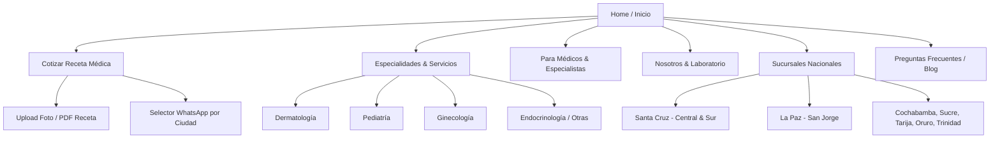

# REWORK INTEGRAL — FARMACIA MUNDO MAGISTRAL S.R.L.
**Auditoría Técnica, Inventario de Activos, Diagnóstico Crítico y Blueprint de Arquitectura**
*Generado por Juapite para Cbass — Septiembre 2026*
*Target URL:* [https://mundomagistral.bo/](https://mundomagistral.bo/)

---

## 1. RESUMEN EJECUTIVO & ESTADO ACTUAL

**Farmacia MundoMagistral S.R.L.** es una empresa farmacéutica boliviana fundada el **18 de octubre de 2019**, especializada en **formulaciones y preparados magistrales** (medicamentos personalizados bajo prescripción médica según las necesidades de cada paciente).

A nivel operativo y físico, la empresa tiene presencia nacional consolidada en **7 departamentos y 8 sedes físicas**:
- Santa Cruz (Sede Central / Norte y Sede Sur/Centro)
- La Paz (Zona San Jorge)
- Sucre
- Trinidad
- Oruro
- Cochabamba
- Tarija

### Estado Diagnóstico de la Web Actual: **Crítico / Incompleto**
La web actual no es una plataforma comercial funcional, sino un **prototipo generado automáticamente y abandonado a mitad de desarrollo**:
1. **Generada por IA de WordPress (ZipWP + Spectra + Astra):** Quedaron páginas de plantilla con textos de broma ("Mariscos Recio", "camarero de día", "Juliana Garcia Encagada" con 3 bloques de *Lorem Ipsum*).
2. **Sin Embudo de Conversión (Fuga Total de Clientes):** Una farmacia magistral vive de que médicos y pacientes envíen sus **recetas médicas para cotizar**. La web actual **no tiene formulario para subir recetas**, ni botón directo de cotización, ni selector inteligente de sucursales.
3. **Página de Inicio Vacía:** La portada (`/`) solo contiene un slider genérico, un eslogan y un párrafo de definición. No hay catálogo, no hay llamadas a la acción (CTAs), no hay especialidades ni listado de sucursales.
4. **Blog con Contenido Basura Indexado:** Artículos públicos en Google titulados *"Hola mundo"*, *"Otro gato"*, *"Lorem Ipsuim"* y *"Página de ejemplo"*.
5. **Rendimiento y Assets:** Imágenes en PNG gigantes (hasta 1.4 MB cada una), sin compresión WebP/AVIF, cargando 11 scripts JS y 6 hojas CSS para mostrar 40 palabras.
6. **Seguridad / Fuga de Datos:** La REST API de WordPress tiene expuesta la lista de usuarios administradores (`juan.miranda` con ID 1) y sitemaps de usuarios abiertos al público.

---

## 2. INFRAESTRUCTURA & STACK TECNOLÓGICO

```
[Cliente / Navegador]
        │
        ▼ (HTTPS / HTTP/2 - HTTP/3 / QUIC)
[LiteSpeed Web Server - Dallas, TX, USA (WHG Hosting / cPanel)]
        │
        ├─► [PHP 8.x Runtime]
        │         │
        │         ├─► WordPress 6.x Core
        │         ├─► Tema: Astra (v4.12.7)
        │         ├─► Builder: Spectra / Ultimate Addons for Gutenberg (v2.19.26)
        │         ├─► Slider: Smart Slider 3
        │         ├─► Formularios: Contact Form 7 (v6.1.5 - inactivo/sin uso)
        │         └─► Plugin de IA: ZipWP (Generador de plantillas)
        │
        └─► [Base de Datos MySQL / MariaDB]
```

### Tabla de Parámetros de Red y Servidor
| Parámetro | Valor Detectado | Observaciones / Riesgo |
| :--- | :--- | :--- |
| **Dominio** | `mundomagistral.bo` | Dominio territorial oficial de Bolivia (.bo). |
| **IP del Servidor** | `192.250.227.14` | Hosteado en Dallas, Texas (WHG Hosting Services Ltd / cPanel). |
| **Servidor Web** | `LiteSpeed` | Soporta HTTP/2 y HTTP/3 (`h3=":443"`). Buen rendimiento base a nivel servidor. |
| **Certificado SSL** | Let's Encrypt (`YR1`) | CN primario configurado como `cpcalendars.mundomagistral.bo`. Configuración desprolija de cPanel (debe emitirse con CN `mundomagistral.bo`). |
| **CMS** | WordPress 6.x | Expone `/wp-json/wp/v2/users` y sitemap de usuarios. |
| **Tema Activo** | Astra v4.12.7 | Tema multipropósito estándar. |
| **Plugins Clave** | `spectra`, `smart-slider-3`, `contact-form-7`, `code-snippets`, `zipwp` | Dependencia innecesaria de sliders pesados y plugins residuales de onboarding. |

---

## 3. BRANDING, IDENTIDAD VISUAL & PALETA CROMÁTICA

A partir del logotipo oficial en formato vectorial SVG (`logomagistral-vf-01.svg`) y la hoja de estilos raíz de Astra, se extrajeron los tokens de diseño oficiales:

### Paleta de Colores
| Token | Código HEX | Rol en UI | Aplicación Recomendada en Rework |
| :--- | :--- | :--- | :--- |
| **Primary (Turquesa Magistral)** | `#00A8AC` | Color de marca / Confianza clínica | Botones de acción primaria (CTAs), iconos médicos, destacados, bordes activos. |
| **Secondary (Púrpura / Violeta)** | `#6F4897` | Identidad farmacéutica / Sofisticación | Headers, barras superiores, acentos secundarios, badges de especialidad. |
| **Dark Slate (Charcoal)** | `#1E293B` | Alto contraste / Tipografía principal | Títulos H1-H3, texto principal de navegación, cards oscuras. |
| **Body Slate** | `#334155` | Legibilidad | Textos de cuerpo, párrafos, descripciones de productos/servicios. |
| **Light BG (Clinical Tint)** | `#F0F5FA` | Fondo secundario / Respiración | Fondos de tarjetas, secciones alternadas, inputs de formulario. |
| **Pure White** | `#FFFFFF` | Fondo primario | Canvas general, tarjetas limpias, contraste de lectura. |
| **Border / Muted** | `#D1D5DB` | Estructura | Líneas divisorias, bordes sutiles de inputs y tablas. |
| **WhatsApp Green** | `#25D366` | Canal de venta crítico | Botón flotante y enlaces de cotización rápida hacia WhatsApp. |

### Tipografía Actual vs Recomendada
- **Actual:** Sistema nativo genérico (`system-ui, BlinkMacSystemFont, Segoe UI, Roboto...`). Carece de jerarquía editorial.
- **Propuesta para el Rework:**
  - **Display / Títulos:** `Plus Jakarta Sans` o `Outfit` (moderna, médica, con pesos 600 y 700 que transmiten seriedad científica).
  - **Body / Lectura:** `Inter` o `DM Sans` (legibilidad absoluta en móvil para prospectos, dosificaciones y textos farmacéuticos).

---

## 4. INVENTARIO COMPLETO DE ACTIVOS DESCARGADOS

Todos los archivos multimedia han sido rescatados del servidor y clasificados localmente en la carpeta del proyecto `./assets/` (Total: **46 archivos, ~10.8 MB**):

### 4.1. Logotipos y Favicons (`assets/logos/`)
| Archivo | Tipo / Formato | Dimensiones | Rol / Uso en el Rework |
| :--- | :--- | :--- | :--- |
| `logomagistral-vf-01.svg` | SVG Vectorial | 216x126 | **Logotipo oficial full color** (Turquesa `#00A8AC` + Violeta `#6F4897`). Ideal para Navbar sobre fondo blanco o claro. |
| `logomagistral-vwhite-01.svg` | SVG Vectorial | 216x126 | **Logotipo oficial blanco** (monocromático). Ideal para Footer y Hero con fondo oscuro/púrpura. |
| `logo-white-05.svg` | SVG Vectorial | 216x126 | Variante blanca alternativa. |
| `logomagistral-05.svg` | SVG Vectorial | 216x126 | Variante de logo complementaria. |
| `fav.png` | PNG | 512x512 | Favicon principal de alta resolución. |
| `cropped-fav.png` | PNG | 512x512 | Icono web recortado. |
| `favicom.jpg` | JPG | 512x512 | Icono de respaldo. |

### 4.2. Iconografía y Vectores (`assets/icons/`)
| Archivo | Formato | Dimensión | Uso / Sección |
| :--- | :--- | :--- | :--- |
| `mision-05.svg` | SVG | 58x59 | Icono de diana / objetivo para la sección **Misión**. |
| `vision-05.svg` | SVG | 58x59 | Icono de telescopio / ojo para la sección **Visión**. |
| `filosofia-05.svg` | SVG | 58x59 | Icono de ADN / engranes para la sección **Filosofía**. *(En la web vieja no se usaba por error de maquetación)*. |
| `email-05.svg` | SVG | 58x59 | Icono de sobre / correo para canales de atención. |
| `whataspp-05.svg` | SVG | 58x59 | Icono de WhatsApp para canales de atención. |
| `WHASATPP-02.svg` | SVG | 93x100 | Icono de WhatsApp con diseño destacado. |
| `palo-07.svg` | SVG | 3x148 | Separador vertical gráfico. |

### 4.3. Banners y Sliders (`assets/banners/`)
| Archivo | Formato | Dimensiones | Peso Original | Uso Original | Recomendación Rework |
| :--- | :--- | :--- | :--- | :--- | :--- |
| `PORTADA-HOME.png` | PNG | 1280x336 | 643 KB | Banner principal de Home | Convertir a WebP (~45 KB) o reemplazar por Hero interactivo en código. |
| `banner-op1.png` | PNG | 1900x500 | **1.31 MB** | Slider Home opción 1 | Optimizar o usar como imagen de fondo con overlay. |
| `banner-op2.png` | PNG | 1900x500 | **1.43 MB** | Slider Home opción 2 | Optimizar drásticamente. |
| `BANNER-NUESTRO-EQUIPO.png` | PNG | 1917x336 | 740 KB | Banner cabecera Equipo | Reemplazar por componente UI responsive. |
| `BANNER-NUESTRO-EQUIPO-1280-235.png` | PNG | 1280x235 | 368 KB | Variante responsive cabecera | Reemplazar. |
| `bnnerEQUIPO-02-scaled.jpg` | JPG | 2560x711 | 138 KB | Banner panorámico laboratorio | Utilizable en sección "Laboratorio / Calidad". |
| `SliderContact.jpg` | JPG | 1800x500 | 442 KB | Banner de cabecera Contacto | Optimizar a WebP (~50 KB). |
| `slider1.jpg` | JPG | 1800x500 | 539 KB | Banner general | Optimizar a WebP. |
| `2BNNR.png` / `BNNR.png` | PNG | Varios | ~360 KB | Banners secundarios | Descartar o refactorizar. |

### 4.4. Imágenes de Especialidades y Formas Farmacéuticas (`assets/images/`)
| Archivo | Dimensión | Correlación / Especialidad |
| :--- | :--- | :--- |
| `1.png` | 300x160 | **Dermatología** (Ilustración / Icono) |
| `2.png` | 300x160 | **Ginecología** (Ilustración / Icono) |
| `3.png` | 300x160 | **Pediatría** (Ilustración / Icono) |
| `4.png` | 300x160 | **Endocrinología** (Ilustración / Icono) |
| `5.png` | 300x160 | **Medicina Interna** (Ilustración / Icono) |
| `6.png` | 300x160 | **Gastroenterología** (Ilustración / Icono) |
| `7.png` | 300x160 | **Neuropsiquiatría** (Ilustración / Icono) |
| `8.png` | 300x160 | **Reumatología** (Ilustración / Icono) |
| `FORMAS-FARMACEUTICAS.png` | 1917x336 | Banner de Formas Farmacéuticas (Cápsulas, Jarabes, etc.) |
| `CREMAS.png` | 1280x236 | Banner específico de Cremas y Geles |
| `JABONES.png` | 1280x236 | Banner específico de Jabones terapéuticos |
| `OVULOS.png` | 1280x236 | Banner específico de Óvulos y Supositorios |
| `QUE-ES.png` | 810x869 | Gráfico ilustrativo de Preparación Magistral |
| `doctor.png` | 400x427 | Fotografía stock de médico con estetoscopio |
| `foto.png` | 311x438 | Foto placeholder usada en la sección Equipo |
| `iMAG01Servicios.png` | 700x486 | Gráfico compuesto de servicios médicos |
| `imagFinal.png` | 620x639 | Gráfico de cierre de servicios farmacéuticos |

---

## 5. INVENTARIO EXHAUSTIVO DE CONTENIDOS TEXTUALES REALES

A continuación se reúne toda la información verídica y de valor institucional rescatada de la base de datos de la página:

### 5.1. Identidad Institucional & Filosofía
- **Razón Social:** Farmacia MundoMagistral S.R.L.
- **Fecha de Fundación:** 18 de octubre de 2019.
- **Eslogan / Propuesta de Valor:** *"Donde la ciencia se convierte en soluciones personalizadas para tu bienestar. Innovamos cada fórmula pensando en ti y en tu salud."*
- **¿Qué es una Farmacia de Manipulación / Magistral?:**
  > *"Una farmacia de preparados magistrales elabora medicamentos personalizados según prescripción médica, adaptados a las necesidades específicas y únicas de cada paciente."*
- **¿Quiénes Somos?:**
  > *"En Mundo Magistral SRL somos una farmacia especializada en formulaciones magistrales, creada el 18 de octubre de 2019 con el propósito de brindar soluciones personalizadas y efectivas a cada paciente. Nuestro compromiso es acompañar al profesional médico en Bolivia, ofreciendo asesoramiento técnico continuo y opciones farmacéuticas adaptadas a las necesidades individuales. Nos destacamos por la confianza, la calidad y la accesibilidad, buscando siempre la satisfacción del paciente y la fidelización del médico. Cada fórmula que elaboramos refleja nuestra filosofía: cada paciente es único, y su tratamiento también."*
- **Misión:**
  > *"Facilitar al profesional médico diferentes formas farmacéuticas adecuadas según la necesidad de su paciente, garantizando tratamientos efectivos y satisfactorios. Ofrecer al paciente preparados magistrales en la dosis correcta, con calidad y precios accesibles, brindando una atención diferenciada."*
- **Visión:**
  > *"Ser reconocidos como una farmacia de confianza que ofrece un servicio de calidad, consolidándonos como referentes en formulaciones magistrales en Bolivia."*
- **Filosofía de Trabajo:**
  > *"Cada fórmula es única, como cada paciente. Trabajamos con rigor científico, empatía y compromiso, asegurando que cada preparación magistral sea un reflejo de nuestra dedicación y responsabilidad."*

---

### 5.2. Servicios, Especialidades y Formas Farmacéuticas

#### 8 Especialidades Médicas Atendidas:
1. **Dermatología:** Fórmulas para acné, melasma, rosácea, dermatitis, psoriasis, regeneración cutánea, protectores y despigmentantes.
2. **Ginecología:** Óvulos vaginales específicos, geles hormonales, tratamientos antimicóticos y lubricantes personalizados.
3. **Pediatría:** Ajuste exacto de dosis según peso corporal, jarabes y suspensiones con sabores agradables sin colorantes nocivos, formas orales líquidas de fármacos sólo disponibles comercialmente en tabletas.
4. **Endocrinología:** Modulación hormonal bioidéntica, tratamiento para patologías tiroideas, suplementación metabólica a medida.
5. **Medicina Interna:** Tratamientos multifármaco combinados en dosis únicas, ajustes para pacientes con polifarmacia.
6. **Gastroenterología:** Fórmulas para reflujo, gastritis, protectores de mucosa gástrica, cápsulas con recubrimiento entérico.
7. **Neuropsiquiatría:** Dosificación progresiva y deshabituación controlada, combinaciones fitoterapéuticas y neuromoduladores.
8. **Reumatología:** Antiinflamatorios tópicos y sistémicos en concentraciones exactas, geles transdérmicos para articulaciones.

#### Formas Farmacéuticas Producidas en Laboratorio:
- **Orales sólidas:** Cápsulas personalizadas (gelatina dura, vegetales, gastrorresistentes, microdosis).
- **Orales líquidas:** Jarabes pediátricos/adultos, soluciones, suspensiones, gotas, elixires.
- **Tópicas y Dérmicas:** Cremas emolientes, geles transdérmicos, pomadas, lociones, sérums, espumas, jabones terapéuticos.
- **Especiales y Mucosas:** Óvulos vaginales, supositorios rectales, colirios oftálmicos estériles, gotas óticas y nasales.

---

### 5.3. Directorio Completo de Sucursales a Nivel Nacional

Este es uno de los mayores activos de la empresa que en la web actual se encuentra oculto en un bloque de texto desordenado:

| Departamento / Ciudad | Dirección Exacta | Teléfono / WhatsApp | Email de Contacto | Horario de Atención |
| :--- | :--- | :--- | :--- | :--- |
| **Santa Cruz (Sede Central / Norte)** | Av. Alemana, 1 cuadra antes del 4to anillo, Calle Teniente Antonio Cueto Nº 3110 | `+591 721-69140` | `info@mundomagistral.bo` | Lunes a Viernes: 08:00 – 20:00<br>Sábados: 08:00 – 15:00 |
| **Santa Cruz (Zona Sur / Centro)** | Av. Ejército Nacional, Esq. N° 290 | `+591 721-90030` | `infocentro@mundomagistral.bo` | Lunes a Viernes: 08:00 – 20:00<br>Sábados: 08:30 – 12:30 |
| **La Paz (Zona San Jorge)** | Av. Arce # 2871, Edificio Priscila 1 (Edificio de colores), Planta Baja | `+591 710-30041` | `infolapaz@mundomagistral.bo` | Lunes a Viernes: 08:00 – 20:00<br>Sábados: 08:00 – 15:00 |
| **Sucre** | Calle Uyuni Nº 165 esq. Urriolagoitia, Edificio Integra Medic | `+591 721-51118` | `infosucre@mundomagistral.bo` | Lunes a Viernes: 08:00 – 20:00<br>Sábados: 08:00 – 15:00 |
| **Trinidad (Beni)** | Calle Sucre N.º 617, entre Cipriano Barace y Cochabamba | `+591 721-97622` | `infostrinidad@mundomagistral.bo` | Lunes a Viernes: 08:00 – 20:00<br>Sábados: 08:00 – 15:00 |
| **Oruro** | Calles Aldana y Plata (Frente a la Corte Electoral, a pasos de Segip) | `+591 677-02183` | `ventasoruro@mundomagistral.bo` | Lunes a Viernes: 08:00 – 20:00<br>Sábados: 08:00 – 15:00 |
| **Cochabamba** | Calle Lanza, Esq. Chuquisaca #0706 | `+591 716-54114` | `info@mundomagistral.com` | Lunes a Viernes: 08:00 – 20:00<br>Sábados: 08:00 – 15:00 |
| **Tarija** | Av. Víctor Paz Estenssoro, esquina General Trigo | `+591 716-46110` | `info@mundomagistral.com` | Lunes a Viernes: 08:00 – 20:00<br>Sábados: 08:00 – 15:00 |
| **Línea Central de Atención** | Atención General y Envíos Nacionales | `+591 721-51553` | `info@mundomagistral.com` | Lunes a Viernes: 08:00 – 20:00<br>Sábados: 08:00 – 15:00 |

---

### 5.4. Contenido Basura Detectado que DEBE Eliminarse
1. **URL `/pagina-ejemplo/`:** Contiene el texto de broma de WordPress *"Mariscos Recio... camarero de día, aspirante a actor de noche... Mairena del Alcor"*.
2. **URL `/nuestro-equipo/`:** Repite 3 veces la ficha *"Juliana Garcia Encagada"* con la errata tipográfica y texto genérico de relleno.
3. **URL `/noticias/`:** Muestra 4 entradas con título *"Hola mundo"*, *"Otro gato"*, *"Lorem Ipsuim"* y fotografías repetidas.
4. **URL `/blog/`:** Página completamente en blanco.
5. **Botón "Iniciar Sesión" en el Header:** Enlace `#content` roto.

---

## 6. DIAGNÓSTICO CRÍTICO: MATRIZ DE FALLOS (UX, UI, NEGOCIO, SEO)

| Área | Estado Actual | Impacto Negativo en el Negocio | Solución en el Rework |
| :--- | :--- | :--- | :--- |
| **Conversión Principal** | Inexistente. No hay forma de cotizar una fórmula ni enviar una receta médica. | El 95% de los visitantes que entran con una receta en la mano abandonan la web por no encontrar un botón de acción. | **Hero CTA prominente:** "Cotiza tu Receta por WhatsApp" + Módulo web "Sube la foto de tu receta". |
| **Atención B2B (Médicos)** | Inexistente. Ninguna sección para especialistas. | Los médicos prescriptores no tienen canal para pedir el vademécum, verificar dosis o contactar al Químico Farmacéutico. | **Portal para Profesionales Médicos:** Solicitud de vademécum magistral, líneas de formulación y contacto directo con Dirección Técnica. |
| **Visualización de Sucursales** | Lista de texto plano sin enlaces de mapas ni selección ágil. | El usuario no sabe a qué WhatsApp escribir según su ciudad ni cómo llegar físicamente. | **Selector interactivo de ciudad:** Tabs de ciudad con mapa de Google integrado y botón de WhatsApp configurado con mensaje predeterminado para esa sucursal. |
| **SEO & Redes Sociales** | Título plano "Mundo Magistral", 0 meta descripciones, 0 etiquetas Open Graph (OG). | Al enviar el enlace por WhatsApp no aparece ni el logo ni resumen de la empresa. En Google no rankea para "receta magistral Bolivia". | Implementación de Open Graph tags completos, Schema.org tipo `Pharmacy` / `MedicalBusiness` y meta tags orientados a intenciones de búsqueda médica en Bolivia. |
| **Performance Web** | Banners en PNG pesados (>1.4 MB) + Smart Slider 3 + scripts bloqueantes. | Carga móvil lenta en redes 4G bolivianas (LCP superior a 4.5 segundos). | Reemplazo por imágenes WebP responsivas (<80 KB) y CSS puro o Tailwind, eliminando librerías innecesarias. |
| **Seguridad de Datos** | Rutas `/wp-json/wp/v2/users` expuestas. | Permite a terceros enumerar nombres de usuario del backend para ataques de fuerza bruta. | Desactivar REST API para endpoints de usuarios y ocultar sitemaps de autores. |

---

## 7. BLUEPRINT DE LA NUEVA WEB (ARQUITECTURA PROPUESTA)

### 7.1. Estructura de Navegación (Sitemap Propuesto)



---

### 7.2. Wireframe Conceptual de la Página Principal (Home)

```
┌────────────────────────────────────────────────────────────────────────┐
│ [TOPBAR] 📞 Central: +591 721-51553 | 🕒 Lun-Vie 8-20h | 📍 8 Sucursales│
├────────────────────────────────────────────────────────────────────────┤
│ [LOGO] MundoMagistral    Inicio | Servicios | Médicos | Sedes | Contacto│
│                          [ 🟢 COTIZAR RECETA ]                        │
├────────────────────────────────────────────────────────────────────────┤
│ [HERO SECTION]                                                         │
│   H1: Tu Medicamento Hecho a Medida, en la Dosis Exacta               │
│   P: Elaboramos fórmulas magistrales personalizadas bajo prescripción │
│      médica con los más altos estándares científicos en Bolivia.       │
│                                                                        │
│   [ 📤 Subir Receta Online ]       [ 💬 Cotizar por WhatsApp ]        │
│   (Mini badge: "Despacho a todo el país | Laboratorio Certificado")    │
├────────────────────────────────────────────────────────────────────────┤
│ [CÓMO FUNCIONA EL SERVICIO - 3 PASOS SIMPLES]                          │
│   [1. Tu Médico Prescribe]   [2. Preparamos tu Fórmula] [3. Recibe]   │
│   Tu doctor indica la        En nuestro laboratorio     Retira en tu  │
│   fórmula personalizada.     con materias primas puras. sucursal o    │
│                              y control estricto.        envío a casa. │
├────────────────────────────────────────────────────────────────────────┤
│ [ESPECIALIDADES MÉDICAS ATENDIDAS - GRID INTERACTIVO]                  │
│   [Dermatología]  [Pediatría]     [Ginecología]   [Endocrinología]   │
│   [Med. Interna]  [Gastroenter.]  [Neuropsiqu.]   [Reumatología]     │
├────────────────────────────────────────────────────────────────────────┤
│ [FORMAS FARMACÉUTICAS DISPONIBLES]                                     │
│   Cápsulas | Cremas y Geles | Jarabes y Gotas | Óvulos y Supositorios │
│   Jabones Terapéuticos | Colirios Estériles                           │
├────────────────────────────────────────────────────────────────────────┤
│ [SELECTOR INTERACTIVO DE SUCURSALES]                                   │
│   [Santa Cruz] [La Paz] [Cochabamba] [Sucre] [Tarija] [Oruro] [Trinidad│
│   ┌──────────────────────────────────────────────────────────────────┐ │
│   │ Sede Santa Cruz Central - Av. Alemana / Cueto Nº 3110            │ │
│   │ 🕒 8:00 - 20:00 | 📞 721-69140 | [ 🗺️ Ver Mapa ] [ 💬 WhatsApp ]│ │
│   └──────────────────────────────────────────────────────────────────┘ │
├────────────────────────────────────────────────────────────────────────┤
│ [SECCIÓN EXCLUSIVA PARA PROFESIONALES MÉDICOS]                         │
│   "¿Eres médico? Sé nuestro aliado en formulación magistral"           │
│   [ 📄 Solicitar Vademécum ]   [ 👨‍⚕️ Hablar con Dirección Técnica ]   │
├────────────────────────────────────────────────────────────────────────┤
│ [FOOTER]                                                               │
│   Col 1: Logo Blanco + Propuesta de Valor                              │
│   Col 2: Enlaces Rápidos (Servicios, Nosotros, Políticas)              │
│   Col 3: Sucursales y Teléfonos Directos                               │
│   Col 4: Certificaciones y Redes Sociales Oficiales                   │
└────────────────────────────────────────────────────────────────────────┘
```

---

### 7.3. Funnel de Cotización de Recetas (El Corazón del Rework)

El formulario debe ser limpio, accesible en un clic desde móvil y desktop:

1. **Campos Requeridos:**
   - **Nombre completo** del paciente / solicitante.
   - **Ciudad / Departamento** (para dirigirlo a la sucursal más cercana).
   - **Teléfono / WhatsApp** (para enviarle el presupuesto).
   - **Adjunto:** Foto nítida o archivo PDF de la receta médica.
   - **Observaciones:** Alergias, preferencias de sabor (en jarabes pediátricos) o instrucciones especiales del doctor.
2. **Acción tras Enviar:**
   - Opción directa: Abrir WhatsApp con el mensaje pre-armado y los datos del formulario ya completados:
   `"Hola Mundo Magistral! Mi nombre es [Nombre], estoy en [Ciudad]. Adjunto mi receta para cotización de preparados magistrales."`
   - Envío simultáneo por webhook / email al farmacéutico encargado de la sucursal seleccionada.

---

## 8. RECOMENDACIÓN DE STACK TECNOLÓGICO PARA EL DESARROLLO

Dependiendo de cómo prefieras encarar el desarrollo con Cbass, acá tenés las dos mejores rutas técnicas:

### Alternativa A: **Astro + Tailwind CSS (Recomendada - Máxima Velocidad & Cero Mantenimiento)**
- **Ventajas:**
  - Carga ultra veloz (100/100 en Google PageSpeed), HTML estático generado con 0 KB de JS innecesario.
  - Hospedaje gratuito o casi gratuito en Cloudflare Pages, Vercel o en el mismo hosting LiteSpeed actual mediante build exportada.
  - Se puede implementar un formulario serverless o integración directa con WhatsApp API en minutos.
  - Inmune a hackeos típicos de WordPress (no hay plugins vulnerables ni base de datos expuesta).

### Alternativa B: **WordPress Moderno Limpio (Headless o Tema a Medida)**
- Si el cliente exige un panel de administración para editar artículos o sucursales:
  - **Eliminar:** ZipWP, Smart Slider 3, Spectra y temas pesados.
  - **Instalar:** Tema minimalista o desarrollo en bloques nativos (FSE) o ACF (Advanced Custom Fields).
  - **Formularios:** Fluent Forms o WPForms Pro para subida fluida de archivos con notificación a WhatsApp.
  - **Optimización:** LiteSpeed Cache bien configurado con conversión automática a WebP y Redis/Object Cache.

---

## 9. ROADMAP DE IMPLEMENTACIÓN PASO A PASO

1. **Fase 1: Preparación de Activos y Limpieza**
   - [x] Extracción y clasificación de los 46 archivos multimedia originales en `./assets/`.
   - [x] Vectorización y verificación de paleta cromática (`#00A8AC`, `#6F4897`).
   - [ ] Conversión de banners e imágenes PNG a formato WebP optimizado para web.
2. **Fase 2: Estructuración y Maquetación de Componentes**
   - [ ] Maquetar Navbar responsive con logotipo oficial y botón CTA WhatsApp flotante.
   - [ ] Implementar Hero interactivo con doble CTA (Cotizar por WhatsApp / Subir Receta).
   - [ ] Diseñar el módulo interactivo de las 8 especialidades médicas atendidas.
   - [ ] Diseñar el selector interactivo de las 8 sucursales en Bolivia con mapa y enlace directo a cada WhatsApp local.
   - [ ] Crear el formulario de cotización de receta con opción de carga de foto/PDF.
3. **Fase 3: Sección Institucional & Sección Médicos**
   - [ ] Redactar y montar la historia, misión, visión y filosofía de laboratorio desde 2019.
   - [ ] Diseñar la página / modal para Profesionales Médicos (descarga de vademécum y contacto técnico).
4. **Fase 4: SEO Técnico, Seguridad & Despliegue**
   - [ ] Configurar metadatos Open Graph, Twitter Cards y Favicons.
   - [ ] Agregar Schema.org de tipo `Pharmacy` con coordenadas y teléfonos de todas las sedes bolivianas.
   - [ ] Bloqueo de rutas expuestas de usuarios de WordPress.
   - [ ] Verificación en móviles y pruebas de velocidad (PageSpeed Score > 90).
